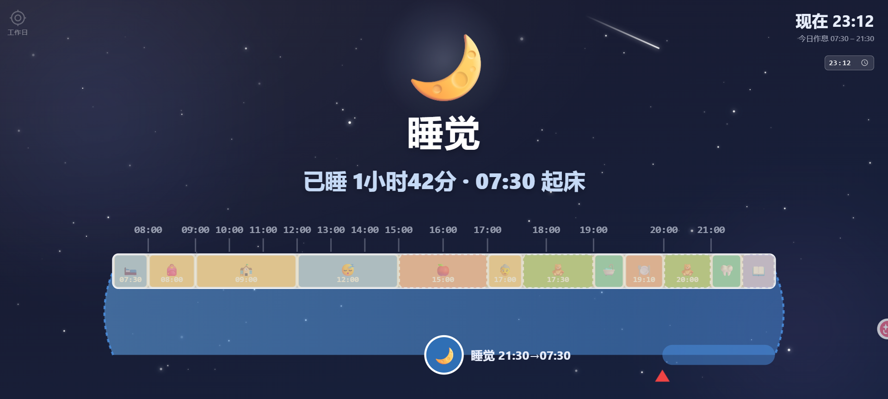
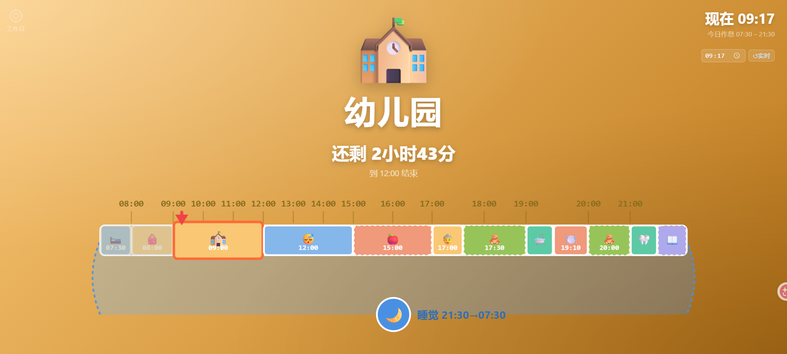
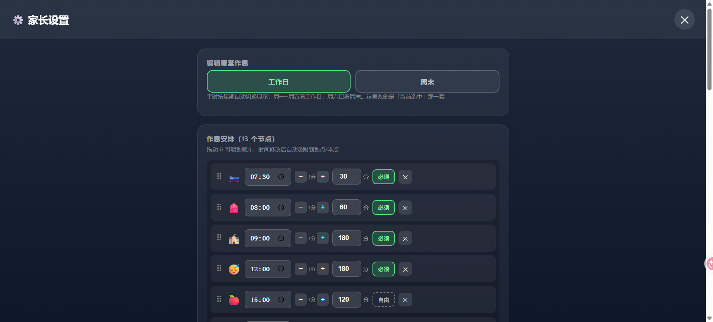
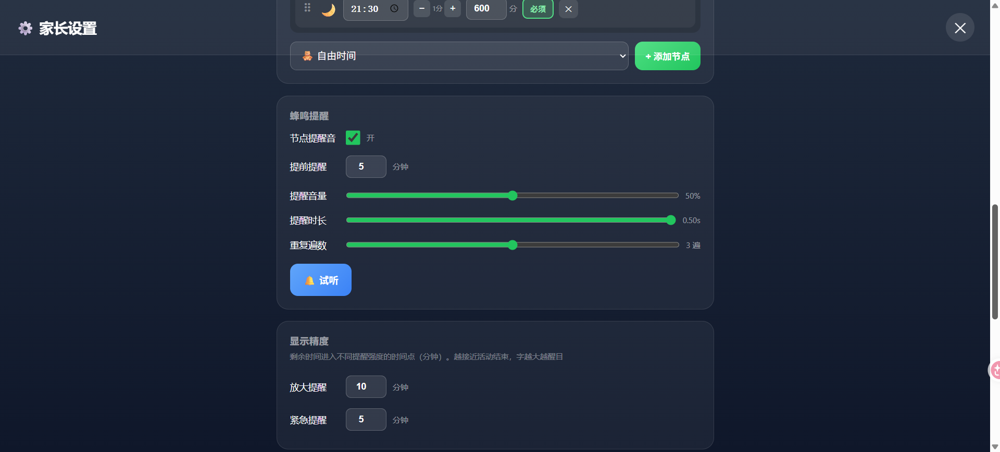
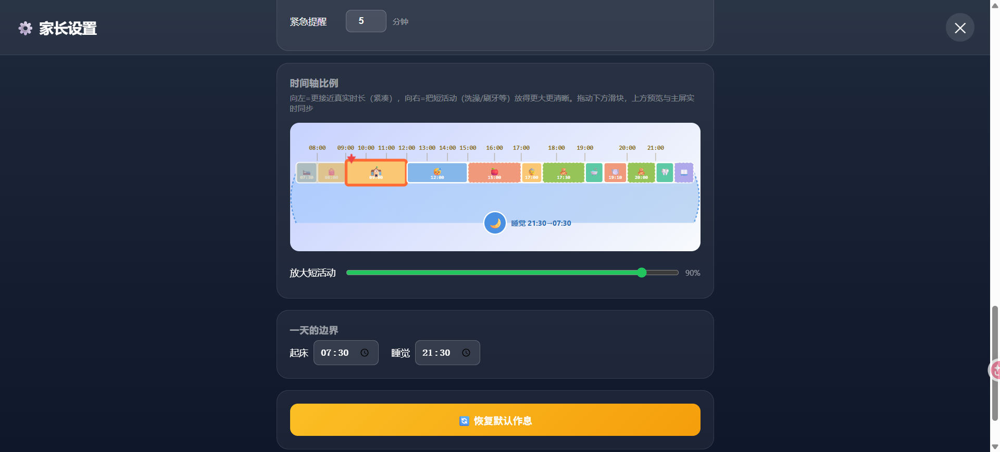

# 🕐 嘀嗒童行 (TickTots) · 儿童时间陪伴时钟

> 为 2–5 岁孩子设计的「时间可视化挂钟」——让孩子不靠识字，也能看懂「现在该干嘛、还要等多久」。
>
> **网页版：打开就能用，不注册、不装 App。** 配一次，生成一张你家的时间轴。

[](https://opensource.org/licenses/MIT)
[](https://svelte.dev)
[](https://web.dev/progressive-web-apps/)
[](https://nodejs.org)

**体验链接**：（部署后在此填入正式 URL，微信里点开即用）

---

## 🌐 网页版怎么用（最短路径）

1. **打开设置页**：选一套模板（3 岁 / 4 岁 / 5 岁），点一下就有 7 个时间段
2. **微调**：改昵称、时间、名称；不需要的删掉，想加的加上（最多 10 个）
3. **点「生成我家的时间轴」**：跳到展示页，右下角「分享给家人」出二维码 / 链接
4. **挂墙**：平板横放 → 添加到主屏幕 → 打开就是全屏时间轴，屏幕常亮

**隐私承诺：所有数据只存在你自己的设备上，我们不收集任何信息。**

- 配过一次，该设备下次打开还在（本地存储）
- 换设备 / 给家人用：发链接或二维码即可（链接里带着配置，无需注册）
- 兜底备份：设置页可导出 / 导入 JSON
- 断网也能开（PWA 离线缓存）

> iPhone 用 Safari 打开 → 分享 → 添加到主屏幕。安卓 / 微信里打开后同样可添加。

---

## 🖥 自部署版怎么用（带服务端，局域网多设备）

> 面向开发者。网页版（上面）不需要这些。

### 开发模式

```bash
cd tick-tots
npm install
npm run server      # 终端 1：启动后端（端口 3010）
npm run dev         # 终端 2：启动前端（端口 5173，/api 自动代理到 3010）
```

访问 http://localhost:5173/

### 生产模式

```bash
npm run build       # 先构建
node server/index.js
```

访问 http://localhost:3010/

> ⚠️ 构建前请先停止正在运行的服务，否则 `dist/` 被占用会导致构建失败。

### 单元测试

```bash
npm test
```

### 局域网多设备

1. 电脑/平板启动服务（挂墙设备直接打开 http://localhost:3010/）
2. 手机连接同一局域网，访问 `http://<电脑IP>:3010/`
3. 手机长按左上角 2 秒进入家长面板，改作息 → 平板实时同步
4. 平板「添加到主屏幕」（PWA），即可挂墙常亮显示

查询电脑 IP：Windows 命令行执行 `ipconfig`，取「IPv4 地址」。

---

## ✨ 功能亮点

- **线性时间轴**：黄色直条 = 白天，蓝色弧线 = 睡觉（跨夜闭环）
- **图标节点**：每个活动一个节点（emoji + 颜色），不依赖识字
- **三态渲染**：已过去（灰）/ 当前（高亮放大）/ 未来（原色）
- **自适应精度**：最后 10 分钟大字红橙脉冲提示
- **三套预置模板**：3 岁 / 4 岁 / 5 岁，一键生成，不必从空白填起
- **链接分享**：生成链接 / 二维码，发给家人打开就是同一套作息
- **蜂鸣提醒**：「嘀-嘀-嘀」三短音，可关
- **屏幕常亮 + PWA**：挂墙设备不熄屏、断网也能开

## 📸 截图

### 🌙 夜间模式（21:30–07:30 自动切换）



> 睡觉时段主屏自动切到深色夜空：🌙 居中带柔和光晕，左右两侧空白区铺满轻闪烁的星星，不时划过流星。
> `prefers-reduced-motion` 下流星和闪烁会自动关闭。

### ☀️ 白天主界面



> 当前活动用大 emoji + 中文名展示，节点按"已过去 / 进行中 / 未来"三态渲染，时间轴显示全天安排。

### ⚙️ 家长面板

长按主屏左上角 2 秒进入，所有可调项都在这里：

|  |  |
|:---:|:---:|
| **作息编辑**：工作日 / 周末两套，拖拽排序节点 | **蜂鸣提醒 + 显示精度**：开关 / 提前时长 / 音量 / 重复 / 阈值 |



> **时间轴比例**：在「纯等比」与「最大化可读」间连续调节，下方实时预览当天时间轴的样子。

---

设计稿预览：`docs/design/01-主界面设计稿.html`、`docs/design/02-家长面板设计稿.html`

## 🛠 家长面板操作

| 操作 | 说明 |
|------|------|
| 打开 | 长按屏幕左上角 2 秒（展示页带分享链接进来时为防孩子误触，改为右上角齿轮回设置页） |
| 拖拽排序 | 按住 ⠿ 上下拖动（交换两节点时间段） |
| 改时间 | 点时间框修改，自动吸附到整点/半点（±5 分钟） |
| 微调 | − / + 按钮，每次 1 分钟 |
| 必须/自由 | 点「必须/自由」切换（实线框 = 必须做，虚线框 = 自由） |
| 添加节点 | 底部选活动 → 点「+ 添加节点」 |
| 蜂鸣开关 | 「蜂鸣提醒」分组里开关 + 试听 |

## 📂 目录结构

```
src/
├── App.svelte                    # 主应用（hash 路由：#/ 设置页、#/view 展示页）
├── main.ts                       # 入口
├── lib/
│   ├── activities.ts             # 活动定义（emoji + 配色）
│   ├── timeline.ts               # 挂钟模型（核心逻辑）
│   ├── timeline.test.ts          # 单元测试
│   ├── templates.ts              # 三套预置模板（3/4/5 岁）
│   ├── share.ts                  # 链接携带配置的编解码（+ 降级）
│   ├── adapter.ts                # 新旧数据模型适配层
│   ├── validate.ts               # Config 结构校验
│   ├── meta.ts                   # 本地埋点（三个事件，不上报）
│   ├── wakelock.ts               # 屏幕常亮
│   ├── beeper.ts                 # 蜂鸣提醒
│   ├── stores/timer.ts           # 配置 store（本地存储 + URL 初始化）
│   └── components/
│       ├── Setup.svelte          # 设置页（家长）
│       ├── ShareModal.svelte     # 分享弹层（复制链接 / 二维码）
│       ├── Timeline.svelte       # 线性时间轴视图
│       ├── Onboarding.svelte     # 首次引导
│       └── ParentPanel.svelte    # 家长面板
server/
└── index.js                      # Node 零依赖服务（API + SSE + 静态服务，自部署版用）
public/
├── manifest.json                 # PWA 配置
├── sw.js                         # Service Worker（离线缓存）
└── icon.svg                      # 图标
```

## 🤝 贡献指南

欢迎提 Issue 和 Pull Request！

1. Fork 本仓库并 `git clone` 到本地
2. 从 `main` 切出功能分支：`git checkout -b feature/你的功能`
3. 提交改动：`git commit -m "feat: 简述改动"`
4. 推送分支：`git push origin feature/你的功能`
5. 在 GitHub 发起 Pull Request 到 `main`，描述改动与测试情况
6. 评审通过后由维护者合并

> 提交信息建议遵循 [Conventional Commits](https://www.conventionalcommits.org/)（如 `feat:` / `fix:` / `docs:` / `chore:`）。

## 📋 已知限制

- Android Chrome 后台会节流定时器，但挂墙场景页面始终前台，影响不大
- iOS 需手动「添加到主屏幕」，Android 自动提示
- 时间轴基于设备本地时间，时区变化后自动重新计算
- 网页版数据只存本地（localStorage + 链接），不上传任何服务器
- 自部署版数据存于 `server/data/state.json`，不出局域网

## 🙏 致谢

底座基于 [basnijholt/tot-clock](https://github.com/basnijholt/tot-clock)（MIT）改造为挂钟模型，感谢原作者。

## 📄 许可证

[MIT](LICENSE) © Renzy

---

## 👤 关于作者

我是 **Renzy**（AI 产品经理）· 公众号 **「PM 的 AI 进阶之路」**（微信搜 `renzy-ai`）。更多项目与 AI / 职场思考，见我的 [GitHub 主页](https://github.com/renzy-ai)。
